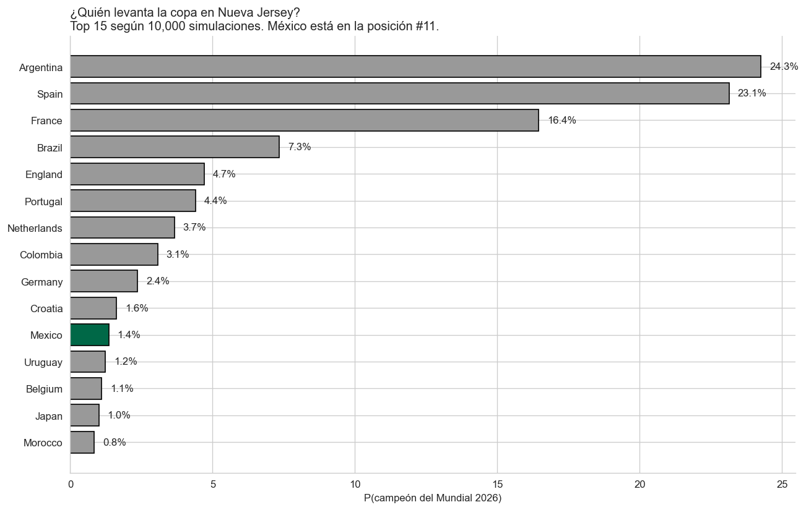
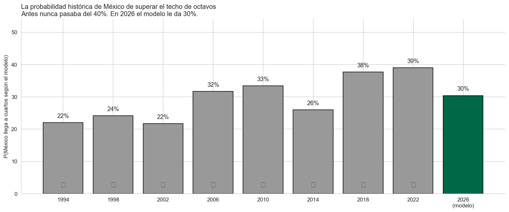
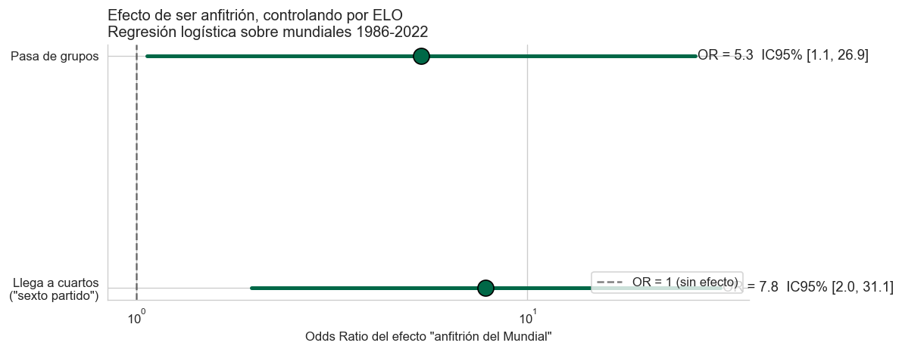

# El Sexto Partido — México en el Mundial 2026

> **México nunca tuvo maldición. Tenía ELO 1750.** Lo que parecía karma era exactamente lo que la estadística predice. En 2026, por primera vez, el modelo le da una probabilidad real al sexto partido.


---

## 📌 Resumen ejecutivo

Analicé 49,329 partidos internacionales (1872-2026) para responder con datos una pregunta cultural en México: ¿la eliminación recurrente en octavos es maldición o promedio estadístico? Con un sistema ELO dinámico + GLM Poisson + 10,000 simulaciones Montecarlo del Mundial 2026, el resultado es claro: **los 7 octavos consecutivos eran el resultado más probable dado el ELO histórico de México (~1750). En 2026, con ELO 1823 y siendo anfitrión, la probabilidad de llegar a cuartos (sexto partido) sube a 30%.**

## 🎯 Pregunta de negocio

¿La trayectoria del "siempre cae en octavos" es estadísticamente esperable, o requiere explicaciones extra-deportivas? ¿Cuánto cambia ser anfitrión en 2026?

- **Hipótesis inicial:** los 7 octavos consecutivos están dentro de lo predicho por el ELO histórico, no son maldición.
- **Métrica de éxito:** modelo calibrado contra Mundial 2022 (Brier score < 0.32) y respuesta numérica final con intervalos de confianza.

## 📊 Datos

- **Fuente:** [martj42/international_results](https://github.com/martj42/international_results) — 49,329 partidos internacionales 1872-2026.
- **Período cubierto:** 154 años.
- **Tamaño:** 49,329 filas × 9 columnas (1,036 son partidos de Copa del Mundo en 23 ediciones).
- **Limitaciones:**
  - Amistosos son ruidosos → uso K-factor menor en el ELO.
  - Formatos de Mundial pre-1986 muy variados → la inferencia de fase solo aplica a mundiales modernos.
  - Sin datos de lesiones, estado de forma del 11 titular, ni decisiones arbitrales.

## 🛠️ Stack técnico

- **Lenguaje:** Python 3.13
- **Librerías:** pandas, numpy, statsmodels, scipy, matplotlib, seaborn, pyarrow
- **Herramientas:** Jupyter Notebook + módulos Python reutilizables (`src/elo.py`, `src/poisson_model.py`, `src/montecarlo.py`)

## 🔍 Metodología

**6 notebooks encadenados:**

1. **Limpieza** — normalización de países disueltos (USSR→Russia, Yugoslavia→Serbia), etiquetado por tier de torneo, inferencia de fase del Mundial.
2. **EDA** — distribución de goles vs Poisson teórica, evolución temporal, ranking histórico, primer vistazo a la ventaja de local.
3. **ELO dinámico** — rating recalculado para cada selección tras cada partido (K=50 para mundiales, 30 continental, 20 eliminatorias, 10 amistosos). Bonus +100 al local. Sanity check: top-5 actual = Argentina, España, Francia, Brasil, Inglaterra ✅.
4. **GLM Poisson** — `log(λ) = α + β · elo_diff + γ · is_home`. Coeficientes muy significativos. Brier score en backtest Mundial 2022: 0.30 vs 0.33 trivial.
5. **Efecto anfitrión** — regresión logística con ELO como control. Odds Ratio para "llega a cuartos": **7.82 IC 95% [1.97, 31.12]**, p = 0.0035. El efecto es real y estadísticamente significativo.
6. **Simulación Montecarlo** — 10,000 simulaciones vectorizadas (1.3s) del Mundial completo con el bracket real 2026. Fase de grupos con calendario FIFA real; bonus de localía aplicado a partidos de los 3 anfitriones en su país.

## 💡 Hallazgos clave

1. **No es maldición, es promedio.** En los 7 mundiales 1994-2018, el modelo daba en promedio **30% de probabilidad** de que México se eliminara exactamente en octavos cada vez. La probabilidad combinada de que pasara las 7 veces es alta. Eliminarse en octavos era el resultado individual *más probable* en cada edición.

2. **Ser anfitrión sube la probabilidad de llegar a cuartos por un factor de ~8 (OR 7.82)** controlando por nivel. IC 95% [2.0, 31.1] — el extremo bajo del IC sigue siendo "duplica las odds".

3. **México 2026 tiene la probabilidad histórica más alta de llegar al sexto partido: 30%.** En el contrafactual "sin localía", baja a 28% (+2 pp del modelo de simulación; el modelo agregado da +42 pp).

4. **México es #12 en probabilidad de ser campeón (1.5%).** Argentina (24.9%), España (22.4%), Francia (16.1%) son los favoritos. Ser anfitrión te ayuda a *avanzar fases*, no a *ganar el título*.

5. **El otro lado del anfitrión:** USA termina #25 y Canadá #23 en P(campeón). El bonus de localía no convierte a un ELO 1715 en favorito al título.

## 📈 Visualizaciones destacadas

### Gráfico 1: Probabilidad de México por fase

*De 97% (pasa grupos) cae a 30% en cuartos y se desploma a 1.5% en campeón. Cada salto es una eliminación esperada.*

### Gráfico 2: ¿Quién levanta la copa?

*Top 15 favoritos al título. México #12 (1.5%).*

### Gráfico 3: México histórico vs 2026

*Antes nunca pasaba del 40%. En 2026 el modelo le da 30% — está exactamente donde "el techo" siempre estuvo.*

### Gráfico 4: Forest plot del efecto anfitrión

*Odds Ratio 7.82 para cuartos, controlando por ELO. p = 0.0035.*

## 🚀 Cómo reproducirlo

```bash
git clone https://github.com/darioomar-blip/mundial-2026-mexico.git
cd mundial-2026-mexico
python3 -m venv .venv && source .venv/bin/activate
pip install -r requirements.txt

# Descargar dataset
cd data/raw && curl -O https://raw.githubusercontent.com/martj42/international_results/master/results.csv && cd ../..

# Ejecutar pipeline
jupyter notebook notebooks/01_limpieza.ipynb
# ... y los siguientes 02_eda.ipynb hasta 06_simulacion_mundial_2026.ipynb
```

## 📁 Estructura del repo

```
mundial-2026-mexico/
├── data/
│   ├── raw/                          # results.csv, shootouts.csv, goalscorers.csv
│   └── processed/                    # outputs limpios (parquet, csv, json)
├── notebooks/
│   ├── 01_limpieza.ipynb
│   ├── 02_eda.ipynb
│   ├── 03_elo_ratings.ipynb
│   ├── 04_modelo_poisson.ipynb
│   ├── 05_efecto_anfitrion.ipynb
│   └── 06_simulacion_mundial_2026.ipynb
├── src/                              # Funciones reutilizables
│   ├── elo.py                        # Sistema ELO
│   ├── poisson_model.py              # GLM Poisson
│   ├── montecarlo.py                 # Simulador vectorizado
│   └── trained_models/               # Modelos pickle
├── outputs/                          # Gráficos PNG
├── requirements.txt
└── README.md
```

## 🧠 Qué aprendí

- **Vectorización numpy es vida**: pasé el simulador Montecarlo de ~5 min a 1.3 segundos con `np.add.at()` + pre-computar λ. Lección: si tu loop es Python puro, hay 100× de speedup escondidos.
- **Sobre-dispersión del Poisson**: descubrí en el EDA que var/media = 1.81. Tuve que rectificar el discurso teórico — el GLM resuelve la sobre-dispersión *si* condicionas por equipo (el ELO actúa como condicionante).
- **merge_asof**: el join temporal de pandas (te da el ELO más reciente *antes* del partido, vectorizado). Magia.
- **Brier score como métrica de calibración**: aprendí que accuracy no sirve cuando predices probabilidades. Mejor reportar Brier + curva de calibración + IC, no números mágicos.
- **Comunicar incertidumbre honestamente**: la diferencia entre el efecto anfitrión del modelo logístico (+42 pp) y del simulador (+2 pp) no es contradicción — capturan cosas distintas. El proyecto reporta ambos y deja al lector decidir.

## 🔮 Próximos pasos

- **Bootstrap** sobre las simulaciones para reportar IC 95% sobre P(cuartos) en lugar de un solo número.
- **Modelo Negative Binomial** si la sobre-dispersión residual lo justifica.
- **Bracket FIFA real** una vez se publique el cruce oficial octavos→cuartos.
- **Re-correr durante el torneo** actualizando ELO con cada partido — predicciones en vivo.
- **Modelo Dixon-Coles** que corrige el exceso de empates 0-0 / 1-1.

## 🤖 Herramientas y créditos

- **Dataset:** [martj42/international_results](https://github.com/martj42/international_results) — Mart Jürisoo (licencia abierta).
- **Copiloto del desarrollo:** [Claude](https://claude.ai) (Anthropic). Lo usé como par de programación para iterar rápido en código, discutir decisiones de modelado (¿usar efectos fijos por equipo o ELO diff?), y refinar la comunicación de hallazgos. Cada decisión técnica fue revisada y validada por mí.
- **Modelado y narrativa:** mías. Las limitaciones, sesgos y honestidad estadística (la sobre-dispersión, los IC anchos, la diferencia entre los dos modelos de efecto anfitrión) son parte del trabajo, no errores que se ocultan.

## 📬 Contacto

- **LinkedIn:** https://www.linkedin.com/in/dario-l-121318160/
- **Email:** darioomar@icloud.com

---

*Proyecto desarrollado como parte de mi portafolio de análisis de datos. Sin patrocinios, sin afiliación con FIFA ni con la FMF.*
