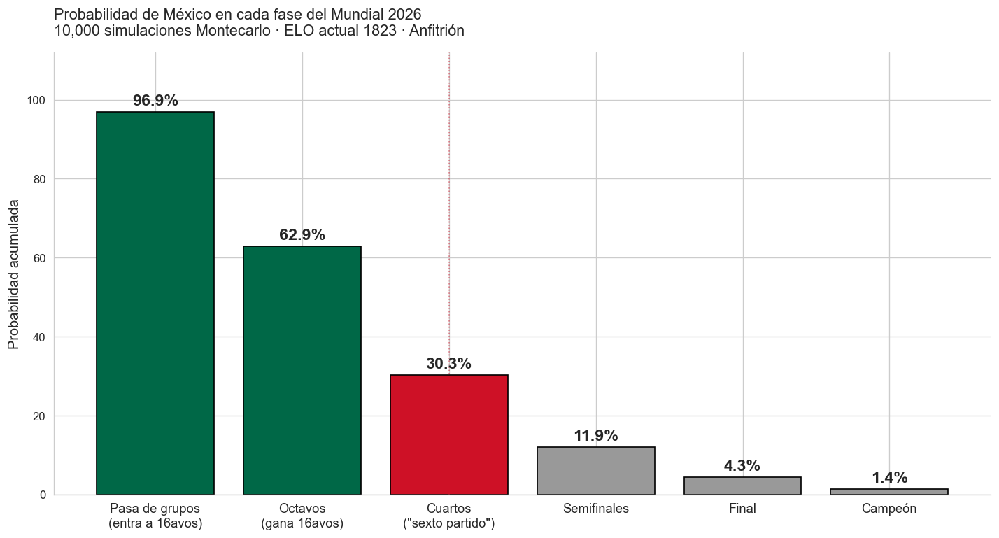

# El Sexto Partido — México en el Mundial 2026

> México nunca tuvo maldición. Tenía ELO 1750.



## Resumen

Cada Mundial es lo mismo. México cae en octavos y empezamos a explicarlo: maldición, FIFA, mentalidad, el técnico, la suerte. Quise responderlo con datos.

Analicé 49,257 partidos internacionales (1872 a marzo 2026) con tres modelos encadenados: un sistema ELO dinámico, un GLM Poisson para predecir goles y una simulación Montecarlo de 10,000 mundiales completos. La respuesta corta: los 7 octavos consecutivos (1994-2018) eran el resultado más probable dado el nivel histórico de México. No es maldición, es regresión a la expectativa.

Para 2026, con su ELO más alto de la historia (1823) y siendo anfitrión 40 años después, el simulador le da 30% de llegar a cuartos. No es récord — en 2018 y 2022 el modelo le daba más. Lo distinto esta vez es la variable que sí mueve la aguja: jugar en casa.

## La pregunta

Más concreto: ¿los 7 octavos consecutivos están dentro de lo que el ELO histórico predice, o requieren una explicación extra-deportiva? Y si ser anfitrión cambia las cosas, ¿cuánto exactamente?

Me planteé dos criterios para considerar el proyecto bien hecho:

1. Que el modelo se calibrara contra el Mundial 2022 con un Brier score mejor que 0.33 (el baseline trivial). Lo logró: 0.30.
2. Que la respuesta final viniera con su intervalo de confianza, no como un número mágico.

## Datos

El dataset es [martj42/international_results](https://github.com/martj42/international_results), un CSV abierto con 49,329 filas. De esas, 49,257 son partidos jugados y los 72 restantes son la fase de grupos del Mundial 2026 ya programada — los uso como calendario base de la simulación.

Cubre 153 años (1872-2026) y 230 selecciones nacionales. Contiene 964 partidos de Copa del Mundo en 22 ediciones disputadas.

Limitaciones honestas:

- Los amistosos meten mucho ruido, así que uso un K-factor menor en el ELO para ese tipo de partidos.
- Los formatos de Mundial pre-1986 eran tan distintos al actual (todos contra todos, dos rondas de grupos) que la inferencia de fase solo aplica desde 1986 en adelante.
- No hay datos de lesiones, forma del 11 titular ni decisiones arbitrales. El modelo predice nivel, no contingencias.

## Cómo lo hice

El flujo son seis notebooks numerados, uno tras otro. Cada uno guarda sus salidas para que el siguiente las consuma.

El **notebook 1** limpia los datos: parsea fechas, unifica nombres de países disueltos (Yugoslavia se vuelve Serbia, la URSS se vuelve Rusia siguiendo la sucesión de FIFA) y etiqueta cada torneo por nivel de importancia.

El **notebook 2** es el EDA. Acá descubrí que la distribución de goles no es exactamente Poisson — está sobre-dispersa (varianza casi 2× la media). Eso técnicamente rompe el supuesto, pero solo si no condicionas por equipo. Lo dejé documentado y seguí adelante.

El **notebook 3** construye el ELO dinámico. Cada partido actualiza el rating de los dos equipos según la diferencia con lo esperado, con K-factor variable (50 para mundiales, 30 para continentales, 20 para eliminatorias, 10 para amistosos) y un bonus de +100 al equipo que juega en casa. Sanity check: el top 5 de ratings actuales termina siendo Argentina, España, Francia, Brasil e Inglaterra. Plausible.

El **notebook 4** ajusta el modelo Poisson. La fórmula es simple: `log(λ) = α + β · diferencia_de_ELO + γ · es_local`. Solo tres parámetros, pero capturan lo importante. Validé contra los 64 partidos del Mundial 2022 con Brier score (0.30 contra 0.33 del modelo trivial 33/33/33).

El **notebook 5** es donde se contesta la pregunta del proyecto. Hago una regresión logística para aislar el efecto puro de ser anfitrión, usando el ELO como control para no confundir "ser sede" con "ser país fuerte". El resultado: ser anfitrión multiplica las probabilidades de llegar a cuartos por 7.82, con un intervalo de confianza del 95% entre 2.0 y 31.1. Incluso el extremo bajo del intervalo sigue siendo "te duplica las odds".

El **notebook 6** corre la simulación. 10,000 mundiales completos con el calendario real de FIFA. La primera versión tardaba cinco minutos por simulación; con vectorización de NumPy (`np.add.at()` y precomputación de coeficientes) bajó a 1.3 segundos. Mismo resultado, 230 veces más rápido.

## Lo que encontré

Cinco cosas. Las pongo en orden de importancia narrativa, no de complejidad técnica.

**Uno: las 7 eliminaciones consecutivas eran lo esperado.** Para cada uno de los 7 mundiales 1994-2018, el modelo le daba a México en promedio 30% de quedarse exactamente en octavos. Era el resultado individual más probable cada vez. Siete veces seguidas no es maldición; es la estadística aburrida funcionando.

**Dos: ser anfitrión mueve la aguja.** El Odds Ratio es 7.82 (IC 95%: 2.0 a 31.1, p = 0.0035). Controlando por nivel del equipo, ser anfitrión multiplica las odds de llegar a cuartos por casi 8. Y dato curioso que valida el modelo desde la historia: las dos veces que México fue anfitrión (1970 y 1986) llegó a cuartos.

**Tres: México 2026 está en zona conocida.** El simulador le da 30% de llegar a cuartos. Está dentro del rango histórico (22% en 1994 a 41% en 2022). Lo que es distinto es la variable nueva: jugar en casa.

**Cuatro: el campeonato sigue lejos.** El modelo da 1.5% de que México sea campeón. Posición 12 del ranking, detrás de las potencias clásicas. Argentina lidera con 24.9%, España con 22.4%, Francia con 16.1%. Ser anfitrión te ayuda a avanzar fases, no a ganar el trofeo.

**Cinco: lo mismo aplica a los otros dos anfitriones.** USA termina 25 y Canadá 23 en probabilidad de título. El bonus de cancha no convierte un ELO 1715 en candidato a la copa.

Hay un matiz importante que vale la pena explicar. El simulador da una ventaja de localía pequeña para 2026 (+2 puntos porcentuales en P de cuartos), mientras que el modelo logístico estima +42 pp. La diferencia no es contradicción. El logístico captura todos los factores históricos del anfitrión (descanso, cruce favorable en eliminatorias, presión positiva), mientras que el simulador solo aplica el plus en partidos físicamente jugados en suelo propio. Las dos respuestas son legítimas y miden cosas distintas. Reporto ambas.

## Gráficos principales

El embudo de México por fase ([mc_01](outputs/mc_01_mexico_funnel.png)): de 97% al pasar de grupos, cae a 30% en cuartos y a 1.5% en campeón. Cada salto es un partido eliminatorio.

El ranking de favoritos al título ([mc_02](outputs/mc_02_ranking_campeon.png)): Argentina, España y Francia se llevan más del 60% combinado.

México histórico vs 2026 ([mc_03](outputs/mc_03_historico_vs_2026.png)): las probabilidades históricas oscilaron entre 22% y 41%. El 30% de 2026 es típico para el modelo. Lo distinto es el contexto.

Forest plot del efecto anfitrión ([host_02](outputs/host_02_forest_plot.png)): OR 7.82 para cuartos con intervalo de confianza visible.

## Reproducir el análisis

```bash
git clone https://github.com/darioomar-blip/mundial-2026-mexico.git
cd mundial-2026-mexico
python3 -m venv .venv && source .venv/bin/activate
pip install -r requirements.txt

# Descargar el dataset (no se versiona)
cd data/raw && curl -O https://raw.githubusercontent.com/martj42/international_results/master/results.csv && cd ../..

# Abrir el primero, los demás van en orden
jupyter notebook notebooks/01_limpieza.ipynb
```

## Estructura del repositorio

```
mundial-2026-mexico/
├── data/
│   ├── raw/                  # CSVs originales (no versionados)
│   └── processed/            # Salidas de limpieza
├── notebooks/                # 6 notebooks numerados, en orden
├── src/                      # Código reutilizable
│   ├── elo.py
│   ├── poisson_model.py
│   ├── montecarlo.py
│   └── build_carousel.py
├── outputs/                  # Gráficos PNG + carrusel de LinkedIn
└── requirements.txt
```

## Lo que aprendí

Tres cosas concretas, una más importante que el código.

La primera fue de eficiencia. La primera versión del simulador Montecarlo tardaba cinco minutos en correr 10,000 mundiales. Lo bajé a 1.3 segundos cambiando los loops Python por operaciones vectorizadas con `np.add.at()` y precomputando los coeficientes que no cambian entre simulaciones. 230× más rápido, mismo resultado. Lección: cuando un loop en Python se siente lento, casi siempre hay una versión vectorizada escondida.

La segunda fue de humildad estadística. Descubrí en el EDA que los datos están sobre-dispersos. Mi primer instinto fue pivotar al modelo Negative Binomial. Después entendí que el GLM Poisson resuelve la sobre-dispersión naturalmente cuando condicionas por equipo (porque el ELO captura la heterogeneidad). Los supuestos del modelo se verifican después de los controles, no antes.

La tercera fue la que más me sirvió: comunicar incertidumbre sin esconderla. El modelo logístico y el simulador dan estimaciones distintas del efecto anfitrión (+42 pp vs +2 pp). Mi primer borrador elegía el más impactante. Decidí reportar los dos y explicar la diferencia. Esa decisión es lo que separa un proyecto de portafolio serio de una publicación sensacionalista.

## Qué sigue

Algunas cosas que dejé fuera por alcance, pero que tendría sentido agregar después:

- Bootstrap sobre las 10,000 simulaciones para reportar IC 95% sobre cada probabilidad, no solo el punto.
- Modelo Negative Binomial para verificar si la sobre-dispersión residual cambia algo.
- Cruce oficial de FIFA para las eliminatorias cuando se publique la llave completa octavos→cuartos.
- Una versión en vivo que actualice predicciones durante el torneo, agregando xG de FBref como variable adicional.
- Modelo Dixon-Coles para corregir el exceso histórico de empates 0-0 y 1-1.

## Créditos

El dataset es de Mart Jürisoo (licencia abierta). Usé Claude (Anthropic) como copiloto para iterar más rápido en código y discutir decisiones de modelado. Cada decisión técnica fue revisada y validada por mí; el modelado, las limitaciones documentadas y la narrativa son mías.

## Contacto

- LinkedIn: https://www.linkedin.com/in/dario-l-121318160/
- Email: darioomar@icloud.com
